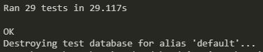

# Cheery

### The happy social media

[Deployed website](https://zoten64-cheery-api-a879390d9f76.herokuapp.com/)

## Table of Contents:

* [Goals and target audience](#goals-and-target-audience)
* [User stories](#user-stories)
* [Epics](#epics)
* [Progress](#progress)
* [User Manual](#user-manual)
* [Features](#features)
* [Bugs and fixes](#bugs-and-fixes)
* [Technologies and tools](#technologies-and-tools)
* [Database Design](#database-design)
* [Validation and testing](#validation-and-testing)
* [Deployment](#deployment)
* [Credits](#credits)

# Goals and target audience

The goal of this project is to provide an API (backend) for the frontend that will be built using React.js. 

Cheery is a social media platform mainly aimed at providing positivity in a world where social media is often filled with negativity and algorithms designed to cause outrage to farm engagement through arguments. Here trolls and bots are not allowed.

The target audience is aimed at those tired of toxic social media apps that does nothing but bring your mood down

# User stories

1. As a user, I want to be able to create a new account so that I can join Cheery
2. As a user, I want to be able to log in to my account so that I can access features restricted to logged in users
3. As a user, I want to be able to add a custom profile picture so I can represent myself better
4. As a user, I want to be able to add a custom biography so others can know more about me
5. As a user, I want to be able to add amy pronouns to my page so others knows how to properly refer to me
6. As a user, I want to be able to make posts so I can share my thoughts and experiences
7. As a user, I want to be able to like (cheer) posts from other users so I can show that I like it
8. As a user, I want to be able to comment on posts from other users so I can share my thoughts on their posts
9. As a user, I want to be able to follow other users so I see their posts and shares in my feed
10. As a user, I want to be able to search for content so I can find things interesting and relevant to myself
11. As a user, I want to be able to receive notifications so I can be notified when someone follows, likes, shares or comments on my post
12. As a user, I want to be able to edit or delete my own posts
13. As a user, I want to be able to edit or delete my own comments
14. As a user, I want to be able to report inappropriate content or users to the app administrators
15. As a user, I want to be able to reposts posts from other users so I can share posts I like to my followers
16. As a user, I want to be able to view trending topics and popular posts so I can keep up with trends
17. As a user, I want to be able to block and report abusive or spammy accounts so that I can help the admins keep this website within guidelines
18. As an admin I want to be able to delete accounts that violate the rules so I can keep the website within guidelines
19. As an admin I want to be able to delete posts that violate the rules so I can keep the website within guidelines
# User stories

1. As a user, I want to be able to create a new account so that I can join Cheery
  - Acceptance Criteria:
    - The user should be able to fill in their username and password and submit the form to create a new account
    - Upon successful account creation, the user should be redirected to the login page
Must have

2. As a user, I want to be able to log in to my account so that I can access features restricted to logged in users
  - Acceptance Criteria:
    - The user should be able to enter their username and password and submit the form to log in
    - Upon successful login, the user should be redirected to their dashboard or the homepage
Must have

3. As a user, I want to be able to add a custom profile picture so I can represent myself better
  - Acceptance Criteria:
    - The user should be able to upload an image file from their device
    - The profile picture should be displayed on the user's profile page and in other relevant sections of the application
Must have

4. As a user, I want to be able to add a custom biography so others can know more about me
  - Acceptance Criteria:
    - The user should be able to enter a biography in their profile settings
    - The biography should be displayed on the user's profile page
Must have

5. As a user, I want to be able to add any pronouns to my page so others know how to properly refer to me
  - Acceptance Criteria:
    - The user should be able to enter their pronouns in 
    - The selected or entered pronouns should be displayed on the user's profile page and in other relevant sections of the application
Could have

6. As a user, I want to be able to make posts so I can share my thoughts and experiences
  - Acceptance Criteria:
    - The user should be able to create posts that can be viewed by others
    - The user should be able to add optional images to the post
    - The created post should be displayed on the user's profile page and in other relevant sections of the application.
Must have

7. As a user, I want to be able to like (cheer) posts from other users so I can show that I like it
  - Acceptance Criteria:
    - The user should be able to like a post
    - The user should be able to unlike a post
    - The number of likes for a post should be updated everytime someone likes or unlikes a post
Must have

8. As a user, I want to be able to comment on posts from other users so I can share my thoughts on their posts
  - Acceptance Criteria:
    - The user should be able to comment on a post
    - The posted comment should be displayed alongside the post and other comments.
Must have

9. As a user, I want to be able to follow other users so I see their posts and shares in my feed
  - Acceptance Criteria:
    - The user should be able to click on a "follow" button on another users page to start following them.
    - The followed user's posts and shares should be displayed in the user's feed
Should have

10. As a user, I want to be able to search for content so I can find things interesting and relevant to myself
   - Acceptance Criteria:
    - The user should be able to enter a search query in a search input field to search
    - The search results should be displayed based on relevance to the search query.
Should have

11. As a user, I want to be able to receive notifications so I can be notified when someone follows, likes, shares, or comments on my post
   - Acceptance Criteria:
    - The user should receive notifications on a specific dropdown list when there is activity related to their posts (e.g., new likes, comments, shares, or followers).
Could have

12. As a user, I want to be able to edit or delete my own posts
   - Acceptance Criteria:
    - The user should be able to edit the content of their own posts and update them.
    - The user should be able to delete their own posts.
Must have

13. As a user, I want to be able to edit or delete my own comments
   - Acceptance Criteria:
    - The user should be able to edit their own comments and update them
    - The user should be able to delete their own comments
Must have

14. As a user, I want to be able to report inappropriate content to the app admins
   - Acceptance Criteria:
    - The user should be able to flag a post as inappropriate and provide a category and reason for the report
    - The reported content or user should be reviewed by the app administrators
Must have

15. As a user, I want to be able to repost posts from other users so I can share posts I like with my followers
   - Acceptance Criteria:
    - The user should be able to click on a "repost" button on a post to share it with their followers
    - The reposted post should be displayed on the user's profile page and on their followers feed
Could have

16. As a user, I want to be able to view trending topics and popular posts so I can keep up with trends
   - Acceptance Criteria:
    - The user should be able to access a trending section
Could have

17. As a user, I want to be able to report abusive or spammy accounts so that I can help the admins keep this website within guidelines
   - Acceptance Criteria:
    - The user should be able to flag a user as inappropriate and provide a category and reason for the report
    - The reported content or user should be reviewed by the app administrators
Must have

18. As an admin, I want to be able to delete accounts that violate the rules so I can keep the website within guidelines
   - Acceptance Criteria:
    - The admin should have the necessary privileges to delete user accounts that violate the rules or guidelines of the website.
    - The deleted accounts should be permanently removed from the system.
Must have

19. As an admin, I want to be able to delete posts that violate the rules so I can keep the website within guidelines
   - Acceptance Criteria:
    - The admin should have the necessary privileges to delete posts that violate the rules or guidelines of the website.
    - The deleted posts should be permanently removed from the system.
Must have

# Epics

1. User Management
  - Epic Description: This epic focuses on user account creation, login, profile customization, and user interaction features such as following, blocking, and reporting.
  - User Stories: 1, 2, 3, 4, 5, 9, 11, 12, 14

2. Post Management
  - Epic Description: This epic covers the creation, editing, deletion, and interaction with posts, including liking, commenting, and reposting.
  - User Stories: 6, 7, 8, 12, 13, 15

3. Content Discovery
  - Epic Description: This epic focuses on features related to content discovery, including searching for content, viewing trending topics, and popular posts.
  - User Stories: 10, 16

4. Admin Tools
  - Epic Description: This epic focuses on providing administrators with the necessary tools to manage user accounts and content that violates the rules.
  - User Stories: 17, 18, 19

# Progress

Below you can find documentation on the progress of the development categorized into dates. Note that not all days may not be documented

 7/9/2024 

User stories have been added to github issues and sorted into milestones/epics

 7/10/2024 

Profiles, posts and attachment functionality has been added as well as a custom view for deleting one's own account

 7/11/2024 

Comments, reports and likes have been added

 7/12/2024 

Notifications, search functionality, ordering functionality and additional info has been added to profiles and posts
All user stories have been finished.

# User manual

# Features

# Bugs and fixes
| Bug | Fixe |
|-----|------|
| Users can delete other users despite permissions staing they shouldn't be able to | Override delete function and manually check if the authenticated user matches the current user object |
# Technologies and tools

### Languages

- HTML
- CSS
- JavaScript
- Python
- JSON

### Platforms

- Heroku
- Code institute postgres database
- Cloudinary
- Github
- Visual Studio Code
- Insomnia for api testing
- Pycodestyle for validation

### Libraries

- Django
  - Used as the backend framework

- Dj database URL
  - Used to access the database

- Django REST Framework
  - Used to make the API

- Django Filter
  - For an easier time filtering data

- Django Allauth
  - For authentication

- Django REST Auth and Dj REST auth
  - Provides drf API endpoints for allauth

- DjangoREST Frmaework SimpleJWT
  - Used for json web tokens

- Django CORS headers
  - Provides Cross Origin Resource Sharing for Django

- Cloudinary and Django Cloudinary Storage
  - Libraries to handle image uploads to cloudinary

- Pillow
  - Adds image processing capabilities

- Gunicorn
  - WSGI HTTP server, required for heroku deployment

- Psycopg2
  -  PostgreSQL adaptor for python

### Dependencies

These are dependencies required for the above libraries

- Asgiref
  - Required by Django

- SQLParse
  - Required by Django

- tzdata
  - Required by Django

- Typing Extensions
  - Required by Dj Database

- Requests
  - Required by Django Cloudinary Storage

- Certifi
  - Required by Requests and Cloudinary

- Charset Normalizer
  - Required by Requests

- Idna
  - Required by Requests

- URLlib3
  - Required by Requests and Cloudinary

- Six
  - Required by Cloudinary and DjangoREST auth

- PyJWT
  - Required by DjangoREST Framework SimpleJWT

- Packaging
  - Required by gunicorn

# Validation and testing

### Validation

Pycodestyle was used for validating the code directory by directory, excluding the migrations folders. Running without errors = no errors found

 Follows 

 Likes 

 Notifications 

 Posts 

 Profiles 

 Reports 

 Reposts 

### Automated Testing

This project features 29 unit tests, all of which pass

# Deployment

# Credits

### Code

- Code Institute Django REST walkthrough
- Django REST documentation
- Django documentation
